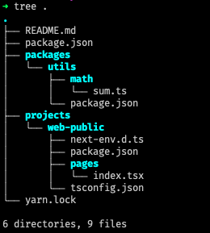
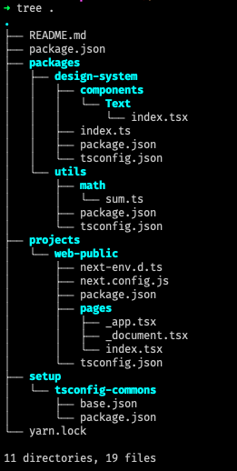

# Arquitetura Front End com NextJS em um MonoRepo

Este repositório tem vários Branchs, cada um com um estado persistido no tempo, na ordem em que foram feitas as modificações. Use `git checkout nome-do-branch` para alterar entre eles e verificar a evolução do código.

Os branchs são:

-  master - branch padrão - Apenas README
-  a1.3 `<-` yarn init -y ; yarn add next react react-dom ; npx gitignore node ; yarn add --dev typescript @types/node @types/react ; yarn install ; yarn dev  `# [also install VSCode editorconfig plugin]`
-  a2.1 `<-` [create packages/utils para funções utilitárias] ; [setup yarn workspaces (https://classic.yarnpkg.com/lang/en/docs/workspaces/)] 
-  a2.2 `<-` yarn design-system add styled-components ; [create components Text] ; [configure projects/web-public/next.config.js] ; yarn web-public add -D next-compose-plugins next-transpile-modules ; yarn dev:web-public
-  a2.3 `<-` [refatoring TypeScript dependencies setup to @alura/tsconfig-commons]
-  a3.2 `<-` [Adding Prettier ESLing config setup]
-  a4.1 -
-  a4.2 -
-  a4.3 -

Para ver todas as branchs use a URL: https://github.com/joao-parana/ts-monorepo-alura-01/branches/stale

**Yarn Workspaces** permite gerenciar as dependências de todos os projetos do MonoRepo em um `package.json` na raiz do repositório.

## Estrutura de diretórios nos diversos branchs

| a2.1 | a2.2 | a2.3 |
| :---: | :---: | :---: |
|    |      |      |
