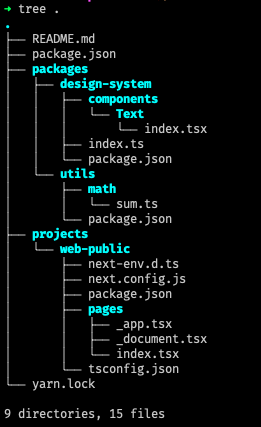

# Arquitetura Front End com NextJS em um MonoRepo

Este repositório tem vários Branchs, cada um com um estado persistido no tempo, na ordem em que foram feitas as modificações. Use `git checkout nome-do-branch` para alterar entre eles e verificar a evolução do código.

Os branchs são:

-  master - branch padrão - Apenas README
-  a1.3 `<-` yarn init -y ; yarn add next react react-dom ; npx gitignore node ; yarn add --dev typescript @types/node @types/react ; yarn install ; yarn dev  `# [ also install VSCode editorconfig plugin ]`
-  a2.1 `<-` [ create packages/utils para funções utilitárias ] ; [ setup yarn workspaces (https://classic.yarnpkg.com/lang/en/docs/workspaces/) ] 
-  a2.2 `<-` yarn design-system add styled-components ; [ create components Text ] ; [ configure projects/web-public/next.config.js ] ; yarn web-public add -D next-compose-plugins next-transpile-modules ; yarn dev:web-public
-  a2.3 `<-` [ refatoring TypeScript dependencies setup to @alura/tsconfig-commons ]
-  a3.2 `<-` [ Adding Prettier ESLint config setup ] ; [ adding projects/web-public/.eslintrc.js, packages/utils/.eslintrc.js and packages/design-system/.eslintrc.js Files ] ; [ Merging 3 ESLint styles ] ; [ Install ESLint plugin in VSCode ]
-  a4.1 `<-` [ Adding @alura/test-commons to run Jest for testing ] ; [ Adding test file for math.sum() ] 
-  a4.2 `<-` [ Adding @alura/test-commons/react-testing-library and packages/design-system/components/Text/index.test.tsx ] 
-  a4.3 `<-` [ Adding and configuring jest-styled-components ] ; yarn && yarn lint && yarn test

Para ver todas as branchs use a URL: https://github.com/joao-parana/ts-monorepo-alura-01/branches/stale

**Yarn Workspaces** permite gerenciar as dependências de todos os projetos do MonoRepo em um `package.json` na raiz do repositório.

## Estrutura de diretórios nos diversos branchs

| a2.1 | a2.2 | a2.3 |
| :---: | :---: | :---: |
|    |      |      |


Para ver o que tem debaixo do capô em termos de WebPack e Babel, assista: https://youtu.be/LMCtGvLJT6c 

### Estrutura de diretórios na versão final

```java
# Visão geral 
tree . -L 2
.
├── README.md
├── package.json
├── packages
│   ├── design-system
│   └── utils
├── projects
│   └── web-public
├── setup
│   ├── eslint-commons
│   ├── test-commons
│   └── tsconfig-commons
└── yarn.lock

9 directories, 3 files

➜ tree packages
packages
├── design-system
│   ├── components
│   │   └── Text
│   │       ├── __snapshots__
│   │       │   └── index.test.tsx.snap
│   │       ├── index.test.tsx
│   │       └── index.tsx
│   ├── index.ts
│   ├── jest.config.ts
│   ├── package.json
│   └── tsconfig.json
└── utils
    ├── jest.config.ts
    ├── math
    │   ├── sum.test.ts
    │   └── sum.ts
    ├── package.json
    └── tsconfig.json

6 directories, 12 files

➜ tree projects
projects
└── web-public
    ├── components
    │   └── AllProviders
    │       └── index.tsx
    ├── jest.config.ts
    ├── next-env.d.ts
    ├── next.config.js
    ├── package.json
    ├── pages
    │   ├── _app.tsx
    │   ├── _document.tsx
    │   └── index.tsx
    ├── screens
    │   └── HomeScreen
    │       ├── HomeScreen.test.tsx
    │       ├── HomeScreen.tsx
    │       └── __snapshots__
    │           └── HomeScreen.test.tsx.snap
    └── tsconfig.json

7 directories, 12 files

➜ tree setup
setup
├── eslint-commons
│   ├── base.js
│   └── package.json
├── test-commons
│   ├── base.ts
│   ├── package.json
│   ├── react-testing-library.tsx
│   └── src
│       └── setupTests.js
└── tsconfig-commons
    ├── base.json
    └── package.json

4 directories, 8 files
```

## Lista completa de HTTP Status code 

https://developer.mozilla.org/en-US/docs/Web/HTTP/Status/100 
